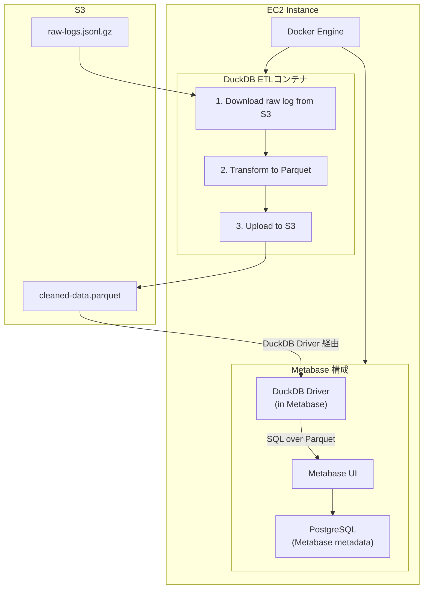

# Metabase + DuckDB + PostgreSQL on Docker

S3上のJSONLログをDuckDBでParquetに変換し、Metabaseで可視化するシステム。

## システム構成図



## プロジェクト構成

```
metabase-duckdb/
├── etl/
│   ├── Dockerfile           # ETLコンテナ定義
│   ├── run_etl.sh          # ETL実行スクリプト
│   └── transform.sql       # DuckDB変換SQL
├── metabase-sql/
│   └── duckdb01.sql        # Metabase用クエリサンプル
├── Dockerfile              # Metabaseコンテナ定義
├── docker-compose.yml      # Docker Compose設定
└── README.md
```

## セットアップ手順

### 1. 前提条件

- Amazon Linux EC2インスタンス
- Docker & Docker Compose V2がインストール済み
- S3バケットへのアクセス権限を持つIAMロール（EC2にアタッチ）

### 2. リポジトリのクローン

```bash
git clone https://github.com/junhat6/metabase-duckdb.git
cd metabase-duckdb
```

### 3. BuildKit無効化（Amazon Linux環境）

```bash
echo 'export DOCKER_BUILDKIT=0' >> ~/.bashrc
source ~/.bashrc
```

### 4. コンテナの起動

```bash
# Metabase + PostgreSQLを起動（ETLは起動しない）
docker compose up -d

# または、ビルドから実行
docker compose up --build -d
```

### 5. Metabaseへアクセス

ブラウザで `http://<EC2のパブリックIP>:3000` にアクセスし、初期設定を実施。
もしくは以下のユーザーでログイン
メールアドレス：
`metabase@email.com`
パスワード
`metabase123`

### 6. ETLの手動実行

```bash
# ETL実行
docker compose run --rm duckdb-etl
```

## データフロー

1. **入力**: `s3://duckdb-metabase-data-junichi/raw/log-*.jsonl.gz`
2. **変換**: DuckDBでJSONLを読み込み、整形してParquetに変換
3. **出力**: `s3://duckdb-metabase-data-junichi/processed/cleaned-data.parquet`

## Metabaseでの利用

1. MetabaseでDuckDBデータベースを追加
2. Native Queryで `metabase-sql/duckdb01.sql` を参考にクエリを作成
3. S3上のParquetファイルを直接クエリ可能

## トラブルシューティング

### BuildKitエラー（`unknown flag: --allow`）

```bash
export DOCKER_BUILDKIT=0
docker compose build --no-cache
```

### メモリ不足エラー

`docker-compose.yml` のメモリ制限を増やす:

```yaml
deploy:
  resources:
    limits:
      memory: 4G
```

### S3アクセスエラー

EC2インスタンスのIAMロールにS3アクセス権限があるか確認:

```bash
aws s3 ls s3://duckdb-metabase-data-junichi/
```

## 定期実行設定（オプション）

cronで定期的にETLを実行:

```bash
crontab -e

# 毎日午前2時に実行
0 2 * * * cd /home/ec2-user/metabase-duckdb && docker compose run --rm duckdb-etl >> /var/log/etl.log 2>&1
```
