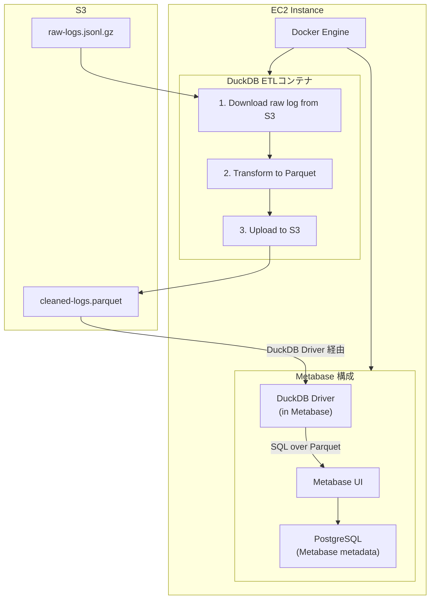

# README

## システム構成図



## プロジェクト構成

```
metabase-duckdb/
├── etl/
│   ├── Dockerfile           # ETLコンテナ定義
│   ├── run_etl.sh          # ETL実行スクリプト
│   └── transform.sql       # DuckDB変換SQL
├── docker-compose.yml      # Docker構成
├── config.env.example      # 設定ファイルサンプル
└── README.md
```

## セットアップ手順

### 1. 前提条件

- Amazon Linux EC2インスタンス
- Docker & Docker Composeがインストール済み
- S3バケットへのアクセス権限を持つIAMユーザー/ロール

  通常の起動（postgresとmetabaseのみ）：
  docker compose up -d

  # または

  docker compose up --build -d

  ETLを手動実行したいとき：

  # 今日の日付でETL実行

  docker compose run --rm duckdb-etl

````


### 7. 定期実行設定（オプション）

EC2上でcronを使用して定期実行:

```bash
# crontabを編集
crontab -e

# 毎日午前2時に前日のログを処理
0 2 * * * cd /path/to/metabase-duckdb && docker-compose run --rm duckdb-etl $(date -d "yesterday" +\%Y-\%m-\%d) >> /var/log/etl.log 2>&1
````

## トラブルシューティング

### DuckDBのメモリエラー

メモリ不足の場合、docker-compose.ymlのメモリ制限を増やしてください:

```yaml
deploy:
  resources:
    limits:
      memory: 4G # 増やす
```

