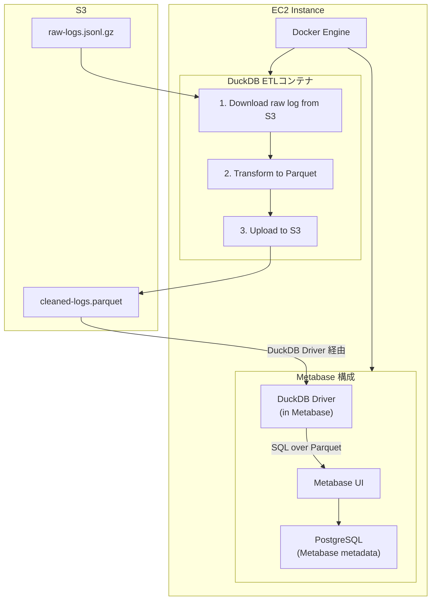

# README

## システム構成図



## プロジェクト構成

```
metabase-duckdb/
├── etl/
│   ├── Dockerfile           # ETLコンテナ定義
│   ├── run_etl.sh          # ETL実行スクリプト
│   └── transform.sql       # DuckDB変換SQL
├── docker-compose.yml      # Docker構成
├── config.env.example      # 設定ファイルサンプル
└── README.md
```

## セットアップ手順

### 1. 前提条件

- Amazon Linux EC2インスタンス
- Docker & Docker Composeがインストール済み
- S3バケットへのアクセス権限を持つIAMユーザー/ロール

### 2. 設定ファイルの準備

```bash
# config.envファイルを作成
cp config.env.example config.env

# 設定を編集
vim config.env
```

config.envの設定例:
```bash
AWS_ACCESS_KEY_ID=your_access_key
AWS_SECRET_ACCESS_KEY=your_secret_key
AWS_DEFAULT_REGION=ap-northeast-1
S3_INPUT_BUCKET=your-bucket-name
S3_OUTPUT_BUCKET=your-bucket-name
```

### 3. Dockerイメージのビルド

```bash
# ETLコンテナをビルド
docker-compose build duckdb-etl
```

### 4. ETL実行

#### 手動実行（今日の日付）

```bash
docker-compose run --rm duckdb-etl
```

#### 特定の日付を指定して実行

```bash
# YYYY-MM-DD形式で日付を指定
docker-compose run --rm duckdb-etl 2025-10-17
```

### 5. データフロー

1. **入力**: `s3://{S3_INPUT_BUCKET}/raw/log-YYYY-MM-DD.jsonl.gz`
2. **変換**: DuckDBでJSONLを読み込み、整形してParquetに変換
3. **出力**: `s3://{S3_OUTPUT_BUCKET}/processed/log-YYYY-MM-DD.parquet`

### 6. transform.sqlのカスタマイズ

ログファイルの実際のスキーマに合わせて、`etl/transform.sql`を編集してください:

```sql
CREATE OR REPLACE TABLE cleaned_logs AS
SELECT
    CAST(json_extract_string(data, '$.timestamp') AS TIMESTAMP) as timestamp,
    json_extract_string(data, '$.level') as log_level,
    json_extract_string(data, '$.message') as message,
    -- 必要なカラムを追加
FROM raw_logs;
```

### 7. 定期実行設定（オプション）

EC2上でcronを使用して定期実行:

```bash
# crontabを編集
crontab -e

# 毎日午前2時に前日のログを処理
0 2 * * * cd /path/to/metabase-duckdb && docker-compose run --rm duckdb-etl $(date -d "yesterday" +\%Y-\%m-\%d) >> /var/log/etl.log 2>&1
```

## トラブルシューティング

### DuckDBのメモリエラー

メモリ不足の場合、docker-compose.ymlのメモリ制限を増やしてください:

```yaml
deploy:
  resources:
    limits:
      memory: 4G  # 増やす
```

### AWS認証エラー

- `config.env`の認証情報が正しいか確認
- EC2インスタンスのIAMロールを使用する場合は、環境変数から認証情報を削除

### S3パスが見つからない

- S3バケット名とパスが正しいか確認
- IAMポリシーでS3への読み書き権限があるか確認

## 次のステップ

ETLが正常に動作したら、Metabaseのセットアップに進みます（後日実装予定）。